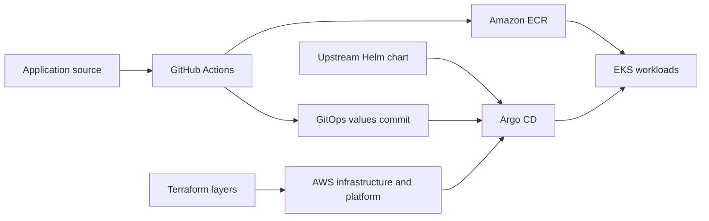

# OpenTelemetry Demo on AWS EKS

An AWS platform engineering project that provisions infrastructure with
**Terraform** and delivers the upstream **OpenTelemetry Demo** through
**Helm, Argo CD, GitHub Actions, and Amazon ECR**.

This repository owns AWS provisioning, platform services, and Argo CD
Application registration. Application source and Kubernetes desired state live
in separate repositories.

## Engineering focus

- Separate Terraform state by lifecycle: backend, infrastructure, platform, and applications.
- Provision networking, EKS, and IAM through reusable Terraform modules.
- Install the AWS Load Balancer Controller with IAM Roles for Service Accounts (IRSA).
- Authenticate GitHub Actions to AWS using OIDC for Recommendation image publishing.
- Let Argo CD reconcile application releases from GitOps values rather than deploying from CI.

The demo application comes from OpenTelemetry. The work here focuses on its
infrastructure, delivery automation, and operational boundaries.

## Architecture

CI builds and publishes an image, then updates the GitOps repository. Argo CD
renders the chart with those values and reconciles the workloads. Terraform
manages infrastructure and platform setup independently of application releases.

## Terraform layers

| Layer | Responsibility |
|---|---|
| [01-bootstrap](terraform/01-bootstrap/) | S3 state bucket with versioning, encryption, and public access blocking; downstream backends use S3 lockfiles |
| [02-infrastructure](terraform/02-infrastructure/) | VPC, subnets, EKS, worker nodes, and cluster IAM/OIDC resources |
| [03-platform](terraform/03-platform/) | AWS Load Balancer Controller with IRSA, and Argo CD |
| [04-applications](terraform/04-applications/) | ECR repositories, GitHub Actions IAM permissions, and Argo CD Application registration |

Start with the backend, then apply layers 02 → 03 → 04. Read the linked layer
documentation and operations guide before provisioning; the configuration uses
project-specific AWS and GitHub settings.

## Documentation

| Goal | Guide |
|---|---|
| Understand the complete delivery path | [Project walkthrough](docs/PROJECT_WALKTHROUGH.md) |
| Review deployment, verification, teardown, and design decisions | [Operations guide](docs/OPERATIONS.md) |
| Inspect infrastructure configuration | [Infrastructure guide](terraform/02-infrastructure/README.md) |
| Inspect platform configuration | [Platform guide](terraform/03-platform/README.md) |
| Inspect application registration and ECR | [Applications guide](terraform/04-applications/README.md) |
| Continue development or review milestones | [Project context](docs/PROJECT_CONTEXT.md) and [changelog](docs/CHANGELOG.md) |

## Implementation and verification

The repository contains the four Terraform layers and the Recommendation
release permissions. The project documentation records EKS deployment and
GitOps delivery milestones. For a current deployment, verify EKS nodes, Argo CD
sync/health, and application pods using the operations guide.

For a release, compare the application workflow run, ECR image tag, GitOps
commit, and deployed image. Recorded milestones do not establish current
cluster health. Future improvements are listed in the operations guide.

## Related repositories

- [otel-demo-apps](https://github.com/lackito/otel-demo-apps): application source and release workflows.
- [otel-demo-gitops](https://github.com/lackito/otel-demo-gitops): AWS Helm values and Argo CD desired state.
- [otel-demo-local](https://github.com/lackito/otel-demo-local): local kind platform and validation tooling.
- [otel-demo-gitops-local](https://github.com/lackito/otel-demo-gitops-local): local Helm values and Gateway resources.
